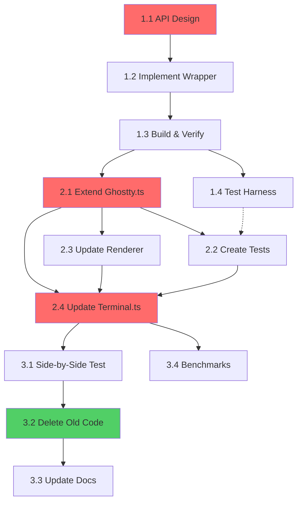

# Ghostty WASM Integration - Complete Roadmap

## 🎯 Project Vision

**Replace 1,475 lines of TypeScript VT100 parser and screen buffer logic with Ghostty's battle-tested WASM exports.**

Currently, the ghostty-wasm project reimplements terminal logic in TypeScript:
- `buffer.ts` (840 lines) - Screen buffer, cursor, scrollback
- `vt-parser.ts` (635 lines) - VT100 state machine

**This is unnecessary duplication.** Ghostty already has a complete, production-tested terminal emulator. We should use it.

### Goals

1. **Export Ghostty's Terminal** - Make the complete terminal emulator available via WASM
2. **Delete TypeScript duplication** - Remove buffer.ts and vt-parser.ts entirely
3. **Keep rendering in TypeScript** - DOM/Canvas operations stay in the browser
4. **Maintain xterm.js compatibility** - API surface stays the same
5. **Improve correctness** - Ghostty handles thousands of VT100 edge cases we'd miss

### Why This Matters

| Current (Bad) | Target (Good) |
|---------------|---------------|
| TypeScript reimplements VT100 parsing | WASM does all parsing |
| TypeScript manages screen buffer | WASM manages buffer |
| Duplicate logic = duplicate bugs | Single source of truth |
| 1,475 lines to maintain | ~200 lines of WASM glue code |
| Limited VT100 compatibility | Full Ghostty compatibility |

---

## 📊 Current State Analysis

### What Exists (Keep)

**TypeScript Layer:**
- ✅ `terminal.ts` (381 lines) - xterm.js API wrapper, lifecycle
- ✅ `renderer.ts` (517 lines) - Canvas drawing, font metrics
- ✅ `input-handler.ts` (438 lines) - Keyboard → KeyEncoder (already uses WASM)
- ✅ `ghostty.ts` (392 lines) - WASM wrapper (will extend)
- ✅ `event-emitter.ts`, `interfaces.ts`, `types.ts` - Infrastructure

**WASM Exports (Current):**
- ✅ `SgrParser` - Color parsing only
- ✅ `KeyEncoder` - Keyboard encoding
- ✅ `OscParser` - OSC sequence parsing
- ✅ Memory allocation helpers

### What We're Replacing (Delete)

- ❌ `buffer.ts` (840 lines) - **DELETE**
  - 2D cell grid
  - Cursor management
  - Scroll regions (DECSTBM)
  - Line operations (insert, delete, erase)
  - Terminal modes (autowrap, insert, origin)
  - Scrollback buffer
  
- ❌ `vt-parser.ts` (635 lines) - **DELETE**
  - VT100 state machine
  - CSI/ESC/DCS sequence parsing
  - Tab stops
  - Cursor movements
  - Screen updates

**Total deletion: ~1,475 lines of complex logic** ✨

### What We're Adding (WASM)

- ✅ Export `Terminal` from Ghostty
  - Complete terminal emulator
  - Integrated VT parser
  - Screen buffer management
  - All terminal state

**Total addition: ~200 lines of C API wrapper + 300 lines of TypeScript integration**

---

## 🏗️ Architecture Transformation

### Before (Current)

```
┌─────────────────────────────────────────────────┐
│ TypeScript Layer                                │
│                                                 │
│  Terminal.ts (API wrapper)                     │
│    ├─► ScreenBuffer.ts (2D grid, 840 lines)   │
│    │     - Cell storage                         │
│    │     - Cursor management                    │
│    │     - Scrollback                           │
│    │     - Scroll regions                       │
│    │                                            │
│    ├─► VTParser.ts (State machine, 635 lines) │
│    │     - Parse CSI/ESC/DCS sequences         │
│    │     - Update ScreenBuffer                  │
│    │     - Tab stops                            │
│    │     └─► Ghostty.SgrParser (colors only)   │
│    │                                            │
│    ├─► Renderer.ts (Canvas drawing)            │
│    │     - Font metrics                         │
│    │     - Draw cells                           │
│    │     - Draw cursor                          │
│    │                                            │
│    └─► InputHandler.ts                         │
│          └─► Ghostty.KeyEncoder ✓              │
└─────────────────────────────────────────────────┘

┌─────────────────────────────────────────────────┐
│ WASM Layer (ghostty-vt.wasm)                   │
│                                                 │
│  - SgrParser (colors only)                     │
│  - KeyEncoder ✓                                │
│  - Memory allocation helpers                    │
└─────────────────────────────────────────────────┘

Total TypeScript: ~2,900 lines
WASM doing: ~5% of work (just colors + keys)
```

### After (Target)

```
┌─────────────────────────────────────────────────┐
│ TypeScript Layer                                │
│                                                 │
│  Terminal.ts (API wrapper, simplified)         │
│    ├─► GhosttyTerminal (WASM wrapper)          │
│    │     - Write data                           │
│    │     - Read lines                           │
│    │     - Query cursor                         │
│    │     - Get dirty regions                    │
│    │                                            │
│    ├─► Renderer.ts (Canvas drawing)            │
│    │     - Font metrics                         │
│    │     - Draw cells                           │
│    │     - Draw cursor                          │
│    │                                            │
│    └─► InputHandler.ts                         │
│          └─► Ghostty.KeyEncoder ✓              │
└─────────────────────────────────────────────────┘
                      │
                      ▼
┌─────────────────────────────────────────────────┐
│ WASM Layer (ghostty-vt.wasm, expanded)         │
│                                                 │
│  Terminal (NEW - complete terminal emulator)   │
│    ├─► Parser (VT100 state machine)            │
│    ├─► Screen (buffer + cursor)                │
│    ├─► PageList (scrollback)                   │
│    ├─► Modes (autowrap, insert, etc.)          │
│    └─► Tabstops                                │
│                                                 │
│  - SgrParser (kept for compatibility)          │
│  - KeyEncoder ✓                                │
└─────────────────────────────────────────────────┘

Total TypeScript: ~1,425 lines (51% reduction)
WASM doing: ~95% of work (all terminal logic)
```

---

## 📋 Task Breakdown

### Phase 1: WASM Foundation (Ghostty Repository)

Work happens in: `/home/coder/cmux/ghostty/investigate`

---

#### **Task 1.1: API Design & Documentation** 📝
**Priority:** CRITICAL (blocks all implementation)  
**Estimated:** 2-3 hours  
**Assignee:** Agent specializing in API design  
**Blocked by:** None

**Objective:** Design the complete C API surface for Terminal exports.

**Deliverables:**

1. **`include/ghostty/vt/terminal.h`** - C header file

```c
#ifndef GHOSTTY_VT_TERMINAL_H
#define GHOSTTY_VT_TERMINAL_H

#include <stdint.h>
#include <stdbool.h>
#include <stddef.h>

#ifdef __cplusplus
extern "C" {
#endif

// Opaque terminal pointer
typedef void* ghostty_terminal_t;

// ============================================================================
// Lifecycle Management
// ============================================================================

/**
 * Create a new terminal instance.
 * 
 * @param cols Number of columns (typically 80)
 * @param rows Number of rows (typically 24)
 * @return Terminal pointer, or NULL on allocation failure
 */
ghostty_terminal_t ghostty_terminal_new(int cols, int rows);

/**
 * Free a terminal instance.
 * 
 * @param term Terminal to free
 */
void ghostty_terminal_free(ghostty_terminal_t term);

/**
 * Resize the terminal.
 * 
 * @param term Terminal instance
 * @param cols New column count
 * @param rows New row count
 */
void ghostty_terminal_resize(ghostty_terminal_t term, int cols, int rows);

// ============================================================================
// Input/Output
// ============================================================================

/**
 * Write data to terminal (parses VT sequences and updates screen).
 * 
 * This is the main entry point - all terminal output goes through here.
 * The data is parsed as VT100/ANSI escape sequences and the screen
 * buffer is updated accordingly.
 * 
 * @param term Terminal instance
 * @param data UTF-8 encoded data
 * @param len Length of data in bytes
 */
void ghostty_terminal_write(ghostty_terminal_t term, const uint8_t* data, size_t len);

// ============================================================================
// Screen Queries
// ============================================================================

/**
 * Get terminal dimensions.
 */
int ghostty_terminal_get_cols(ghostty_terminal_t term);
int ghostty_terminal_get_rows(ghostty_terminal_t term);

/**
 * Get cursor position and state.
 */
int ghostty_terminal_get_cursor_x(ghostty_terminal_t term);
int ghostty_terminal_get_cursor_y(ghostty_terminal_t term);
bool ghostty_terminal_get_cursor_visible(ghostty_terminal_t term);

/**
 * Get scrollback length (number of lines in history).
 */
int ghostty_terminal_get_scrollback_length(ghostty_terminal_t term);

// ============================================================================
// Cell Data Access
// ============================================================================

/**
 * Cell structure - represents a single character position.
 * 
 * This is designed to be simple and C-compatible. Colors are always
 * exported as RGB (terminal color palette is resolved internally).
 */
typedef struct {
    uint32_t codepoint;  // Unicode codepoint
    uint8_t fg_r;        // Foreground color (RGB)
    uint8_t fg_g;
    uint8_t fg_b;
    uint8_t bg_r;        // Background color (RGB)
    uint8_t bg_g;
    uint8_t bg_b;
    uint8_t flags;       // Style flags (see below)
    uint8_t width;       // Character width: 1=normal, 2=wide (CJK), 0=combining
} ghostty_cell_t;

// Cell flags (bitfield)
#define GHOSTTY_CELL_BOLD          (1 << 0)
#define GHOSTTY_CELL_ITALIC        (1 << 1)
#define GHOSTTY_CELL_UNDERLINE     (1 << 2)
#define GHOSTTY_CELL_STRIKETHROUGH (1 << 3)
#define GHOSTTY_CELL_INVERSE       (1 << 4)
#define GHOSTTY_CELL_INVISIBLE     (1 << 5)
#define GHOSTTY_CELL_BLINK         (1 << 6)
#define GHOSTTY_CELL_FAINT         (1 << 7)

/**
 * Get a line of cells from the visible screen.
 * 
 * @param term Terminal instance
 * @param y Line number (0-indexed, 0 = top visible line)
 * @param out_buffer Output buffer (must have space for at least 'cols' cells)
 * @param buffer_size Size of output buffer in cells
 * @return Number of cells written, or -1 on error
 */
int ghostty_terminal_get_line(
    ghostty_terminal_t term,
    int y,
    ghostty_cell_t* out_buffer,
    size_t buffer_size
);

/**
 * Get a line from scrollback history.
 * 
 * @param term Terminal instance
 * @param y Line number (0 = oldest scrollback line)
 * @param out_buffer Output buffer
 * @param buffer_size Size of output buffer in cells
 * @return Number of cells written, or -1 on error
 */
int ghostty_terminal_get_scrollback_line(
    ghostty_terminal_t term,
    int y,
    ghostty_cell_t* out_buffer,
    size_t buffer_size
);

// ============================================================================
// Dirty Tracking (for efficient rendering)
// ============================================================================

/**
 * Check if any part of the screen is dirty.
 */
bool ghostty_terminal_is_dirty(ghostty_terminal_t term);

/**
 * Check if a specific row is dirty.
 */
bool ghostty_terminal_is_row_dirty(ghostty_terminal_t term, int y);

/**
 * Clear all dirty flags (call after rendering).
 */
void ghostty_terminal_clear_dirty(ghostty_terminal_t term);

#ifdef __cplusplus
}
#endif

#endif // GHOSTTY_VT_TERMINAL_H
```

2. **`WASM_API.md`** - API documentation

```markdown
# Ghostty WASM Terminal API

## Overview

This document describes the WASM-exported Terminal API that replaces
the TypeScript `ScreenBuffer` and `VTParser` implementations.

## Core Concept

```
JavaScript: terminal.write("Hello\x1b[31m Red\x1b[0m")
                    ↓
WASM: ghostty_terminal_write(term, data, len)
                    ↓
      - Parse VT sequences
      - Update screen buffer
      - Manage cursor
      - Handle scrollback
                    ↓
JavaScript: const cells = terminal.getLine(0)
            renderer.draw(cells)
```

## Lifecycle

### Creating a Terminal

```typescript
const term = ghostty.exports.ghostty_terminal_new(80, 24);
if (term === 0) {
  throw new Error('Failed to allocate terminal');
}
```

### Writing Data

```typescript
const data = new TextEncoder().encode("Hello, World!\n");
const ptr = ghostty.exports.ghostty_wasm_alloc_u8_array(data.length);
new Uint8Array(ghostty.memory.buffer).set(data, ptr);

ghostty.exports.ghostty_terminal_write(term, ptr, data.length);

ghostty.exports.ghostty_wasm_free_opaque(ptr, data.length);
```

### Reading Screen Content

```typescript
const cols = ghostty.exports.ghostty_terminal_get_cols(term);
const cellSize = 16; // sizeof(ghostty_cell_t)
const bufferSize = cols * cellSize;

const ptr = ghostty.exports.ghostty_wasm_alloc_u8_array(bufferSize);
const count = ghostty.exports.ghostty_terminal_get_line(term, 0, ptr, cols);

// Parse cells
const view = new DataView(ghostty.memory.buffer, ptr);
for (let i = 0; i < count; i++) {
  const offset = i * cellSize;
  const cell = {
    codepoint: view.getUint32(offset, true),
    fg: {
      r: view.getUint8(offset + 4),
      g: view.getUint8(offset + 5),
      b: view.getUint8(offset + 6),
    },
    bg: {
      r: view.getUint8(offset + 7),
      g: view.getUint8(offset + 8),
      b: view.getUint8(offset + 9),
    },
    flags: view.getUint8(offset + 10),
    width: view.getUint8(offset + 11),
  };
  // Render cell...
}

ghostty.exports.ghostty_wasm_free_opaque(ptr, bufferSize);
```

### Querying Cursor

```typescript
const cursor = {
  x: ghostty.exports.ghostty_terminal_get_cursor_x(term),
  y: ghostty.exports.ghostty_terminal_get_cursor_y(term),
  visible: ghostty.exports.ghostty_terminal_get_cursor_visible(term),
};
```

### Efficient Rendering (Dirty Tracking)

```typescript
if (ghostty.exports.ghostty_terminal_is_dirty(term)) {
  for (let y = 0; y < rows; y++) {
    if (ghostty.exports.ghostty_terminal_is_row_dirty(term, y)) {
      const cells = getLine(y);
      renderer.renderLine(y, cells);
    }
  }
  ghostty.exports.ghostty_terminal_clear_dirty(term);
}
```

### Cleanup

```typescript
ghostty.exports.ghostty_terminal_free(term);
```

## Cell Structure

```c
typedef struct {
    uint32_t codepoint;  // Unicode codepoint (e.g., 0x41 = 'A')
    uint8_t fg_r;        // Foreground RGB: 0-255
    uint8_t fg_g;
    uint8_t fg_b;
    uint8_t bg_r;        // Background RGB: 0-255
    uint8_t bg_g;
    uint8_t bg_b;
    uint8_t flags;       // Style bitfield
    uint8_t width;       // 1=normal, 2=wide (CJK/emoji), 0=combining
} ghostty_cell_t;
```

**Total size: 16 bytes**

### Flags Bitfield

```
Bit 0: Bold
Bit 1: Italic
Bit 2: Underline
Bit 3: Strikethrough
Bit 4: Inverse
Bit 5: Invisible
Bit 6: Blink
Bit 7: Faint
```

Example:
```typescript
const isBold = (cell.flags & 0x01) !== 0;
const isItalic = (cell.flags & 0x02) !== 0;
```

## Memory Management

**All allocations are managed by WASM.**

JavaScript never directly manages Terminal memory. The lifecycle is:
1. `ghostty_terminal_new()` - WASM allocates Terminal
2. Use terminal (write, read)
3. `ghostty_terminal_free()` - WASM frees Terminal

For data transfer (write, get_line), JavaScript uses temporary allocations:
1. Allocate buffer with `ghostty_wasm_alloc_u8_array()`
2. Copy data or read results
3. Free with `ghostty_wasm_free_opaque()`

## Error Handling

- `ghostty_terminal_new()` returns `NULL` (0) on allocation failure
- `ghostty_terminal_get_line()` returns `-1` on error
- All other functions assume valid pointers (will crash if NULL)

## Performance Considerations

### Efficient Rendering

```typescript
// ✅ Good: Only render dirty lines
if (terminal.isDirty()) {
  for (let y = 0; y < rows; y++) {
    if (terminal.isRowDirty(y)) {
      renderLine(y);
    }
  }
  terminal.clearDirty();
}

// ❌ Bad: Render everything every frame
for (let y = 0; y < rows; y++) {
  renderLine(y);
}
```

### Batch Reads

```typescript
// ✅ Good: Read entire line at once
const cells = terminal.getLine(y);
renderer.renderCells(cells);

// ❌ Bad: Read cell-by-cell (N WASM calls)
for (let x = 0; x < cols; x++) {
  const cell = terminal.getCell(x, y); // DON'T DO THIS
}
```

## Size & Performance

**Current WASM:** 122 KB  
**With Terminal:** ~300-450 KB (estimated)

**Why the increase?**
- Terminal state machine (~11K lines of Zig)
- Screen buffer (PageList, Page)
- Parser integration
- Scrollback management

**Benefits:**
- Deletes 1,475 lines of TypeScript
- Ghostty's correctness and edge case handling
- Faster parsing (native code vs JS)
- Single source of truth

## What's NOT Included (MVP)

- PTY/process management (separate concern)
- Selection handling (TypeScript manages this)
- Mouse events (TypeScript handles)
- Clipboard operations (TypeScript handles)
- Kitty graphics protocol (future)
- Hyperlinks (future)
- Sixel images (future)
```

**Testing Requirements:**
- None (documentation only)

**Success Criteria:**
- [ ] Header file compiles with C compiler
- [ ] API design reviewed and approved
- [ ] Documentation covers all use cases
- [ ] Memory management strategy is clear

---

#### **Task 1.2: Implement Terminal C Wrapper** 🔧
**Priority:** CRITICAL (blocks TypeScript integration)  
**Estimated:** 4-6 hours  
**Assignee:** Agent with Zig experience  
**Blocked by:** Task 1.1 (API design)

**Objective:** Create the Zig implementation that wraps Terminal.zig with a C API.

**Deliverables:**

1. **`src/terminal/c/terminal.zig`** - Main implementation

```zig
//! C API wrapper for Terminal
//!
//! This provides a C-compatible interface to Ghostty's Terminal for WASM export.

const std = @import("std");
const Allocator = std.mem.Allocator;
const assert = std.debug.assert;
const Terminal = @import("../Terminal.zig");
const size = @import("../size.zig");
const pagepkg = @import("../page.zig");
const Cell = pagepkg.Cell;
const color = @import("../color.zig");

const log = std.log.scoped(.terminal_c);

/// Wrapper struct that owns both the Terminal and its allocator.
/// This is what we return as an opaque pointer to C.
const TerminalWrapper = struct {
    alloc: Allocator,
    terminal: Terminal,
    
    /// Dirty tracking - which rows have changed since last clear
    dirty_rows: []bool,
};

// ============================================================================
// Lifecycle Management
// ============================================================================

export fn ghostty_terminal_new(cols: c_int, rows: c_int) ?*anyopaque {
    // Create allocator
    const gpa = std.heap.GeneralPurposeAllocator(.{}){};
    const alloc = gpa.allocator();
    
    // Allocate wrapper
    const wrapper = alloc.create(TerminalWrapper) catch {
        log.err("Failed to allocate TerminalWrapper", .{});
        return null;
    };
    
    // Create terminal
    const terminal = Terminal.init(
        alloc,
        .{
            .cols = @intCast(cols),
            .rows = @intCast(rows),
        },
    ) catch |err| {
        log.err("Failed to initialize Terminal: {}", .{err});
        alloc.destroy(wrapper);
        return null;
    };
    
    // Allocate dirty tracking
    const dirty_rows = alloc.alloc(bool, @intCast(rows)) catch {
        log.err("Failed to allocate dirty tracking", .{});
        terminal.deinit();
        alloc.destroy(wrapper);
        return null;
    };
    @memset(dirty_rows, true); // Initially all dirty
    
    wrapper.* = .{
        .alloc = alloc,
        .terminal = terminal,
        .dirty_rows = dirty_rows,
    };
    
    return @ptrCast(wrapper);
}

export fn ghostty_terminal_free(ptr: ?*anyopaque) void {
    const wrapper = @ptrCast(*TerminalWrapper, @alignCast(@alignOf(TerminalWrapper), ptr orelse return));
    const alloc = wrapper.alloc;
    
    alloc.free(wrapper.dirty_rows);
    wrapper.terminal.deinit();
    alloc.destroy(wrapper);
}

export fn ghostty_terminal_resize(ptr: ?*anyopaque, cols: c_int, rows: c_int) void {
    const wrapper = @ptrCast(*TerminalWrapper, @alignCast(@alignOf(TerminalWrapper), ptr orelse return));
    
    // Resize terminal
    wrapper.terminal.resize(.{
        .cols = @intCast(cols),
        .rows = @intCast(rows),
    }) catch |err| {
        log.err("Resize failed: {}", .{err});
        return;
    };
    
    // Reallocate dirty tracking
    const new_dirty = wrapper.alloc.realloc(wrapper.dirty_rows, @intCast(rows)) catch {
        log.err("Failed to reallocate dirty tracking", .{});
        return;
    };
    wrapper.dirty_rows = new_dirty;
    @memset(new_dirty, true); // All dirty after resize
}

// ============================================================================
// Input/Output
// ============================================================================

export fn ghostty_terminal_write(ptr: ?*anyopaque, data: [*]const u8, len: usize) void {
    const wrapper = @ptrCast(*TerminalWrapper, @alignCast(@alignOf(TerminalWrapper), ptr orelse return));
    
    // Write data to terminal (this parses VT sequences)
    const slice = data[0..len];
    wrapper.terminal.write(slice) catch |err| {
        log.err("Write failed: {}", .{err});
        return;
    };
    
    // Mark all visible rows as dirty (conservative - could be smarter)
    @memset(wrapper.dirty_rows, true);
}

// ============================================================================
// Screen Queries
// ============================================================================

export fn ghostty_terminal_get_cols(ptr: ?*anyopaque) c_int {
    const wrapper = @ptrCast(*TerminalWrapper, @alignCast(@alignOf(TerminalWrapper), ptr orelse return 0));
    return @intCast(wrapper.terminal.cols);
}

export fn ghostty_terminal_get_rows(ptr: ?*anyopaque) c_int {
    const wrapper = @ptrCast(*TerminalWrapper, @alignCast(@alignOf(TerminalWrapper), ptr orelse return 0));
    return @intCast(wrapper.terminal.rows);
}

export fn ghostty_terminal_get_cursor_x(ptr: ?*anyopaque) c_int {
    const wrapper = @ptrCast(*TerminalWrapper, @alignCast(@alignOf(TerminalWrapper), ptr orelse return 0));
    return @intCast(wrapper.terminal.screen.cursor.x);
}

export fn ghostty_terminal_get_cursor_y(ptr: ?*anyopaque) c_int {
    const wrapper = @ptrCast(*TerminalWrapper, @alignCast(@alignOf(TerminalWrapper), ptr orelse return 0));
    return @intCast(wrapper.terminal.screen.cursor.y);
}

export fn ghostty_terminal_get_cursor_visible(ptr: ?*anyopaque) bool {
    const wrapper = @ptrCast(*TerminalWrapper, @alignCast(@alignOf(TerminalWrapper), ptr orelse return false));
    // Terminal doesn't track cursor visibility directly - assume visible
    return true;
}

export fn ghostty_terminal_get_scrollback_length(ptr: ?*anyopaque) c_int {
    const wrapper = @ptrCast(*TerminalWrapper, @alignCast(@alignOf(TerminalWrapper), ptr orelse return 0));
    return @intCast(wrapper.terminal.screen.pages.scrollback_length);
}

// ============================================================================
// Cell Data Access
// ============================================================================

/// C-compatible cell structure
const GhosttyCell = extern struct {
    codepoint: u32,
    fg_r: u8,
    fg_g: u8,
    fg_b: u8,
    bg_r: u8,
    bg_g: u8,
    bg_b: u8,
    flags: u8,
    width: u8,
};

/// Convert Ghostty's internal Cell to C-compatible GhosttyCell
fn convertCell(terminal: *const Terminal, cell: Cell) GhosttyCell {
    // Resolve colors (palette index → RGB)
    const fg_rgb = terminal.colors.resolveRGB(cell.style.fg);
    const bg_rgb = terminal.colors.resolveRGB(cell.style.bg);
    
    // Build flags bitfield
    var flags: u8 = 0;
    if (cell.style.flags.bold) flags |= 1 << 0;
    if (cell.style.flags.italic) flags |= 1 << 1;
    if (cell.style.flags.underline) flags |= 1 << 2;
    if (cell.style.flags.strikethrough) flags |= 1 << 3;
    if (cell.style.flags.inverse) flags |= 1 << 4;
    if (cell.style.flags.invisible) flags |= 1 << 5;
    if (cell.style.flags.blink) flags |= 1 << 6;
    if (cell.style.flags.faint) flags |= 1 << 7;
    
    return .{
        .codepoint = cell.codepoint(),
        .fg_r = fg_rgb.r,
        .fg_g = fg_rgb.g,
        .fg_b = fg_rgb.b,
        .bg_r = bg_rgb.r,
        .bg_g = bg_rgb.g,
        .bg_b = bg_rgb.b,
        .flags = flags,
        .width = cell.wide,
    };
}

export fn ghostty_terminal_get_line(
    ptr: ?*anyopaque,
    y: c_int,
    out_buffer: [*]GhosttyCell,
    buffer_size: usize,
) c_int {
    const wrapper = @ptrCast(*TerminalWrapper, @alignCast(@alignOf(TerminalWrapper), ptr orelse return -1));
    
    const y_usize: usize = @intCast(y);
    if (y_usize >= wrapper.terminal.rows) return -1;
    
    const cols = wrapper.terminal.cols;
    if (buffer_size < cols) return -1;
    
    // Get the row from the screen
    const row = wrapper.terminal.screen.pages.getRow(.{ .viewport = y_usize }) orelse return -1;
    
    // Convert each cell
    var x: usize = 0;
    while (x < cols) : (x += 1) {
        const cell = row.getCell(@intCast(x)) orelse Cell.default;
        out_buffer[x] = convertCell(&wrapper.terminal, cell);
    }
    
    return @intCast(cols);
}

export fn ghostty_terminal_get_scrollback_line(
    ptr: ?*anyopaque,
    y: c_int,
    out_buffer: [*]GhosttyCell,
    buffer_size: usize,
) c_int {
    const wrapper = @ptrCast(*TerminalWrapper, @alignCast(@alignOf(TerminalWrapper), ptr orelse return -1));
    
    // TODO: Implement scrollback access
    // This requires understanding PageList.getRow with scrollback coordinates
    _ = y;
    _ = out_buffer;
    _ = buffer_size;
    
    return -1; // Not implemented yet
}

// ============================================================================
// Dirty Tracking
// ============================================================================

export fn ghostty_terminal_is_dirty(ptr: ?*anyopaque) bool {
    const wrapper = @ptrCast(*TerminalWrapper, @alignCast(@alignOf(TerminalWrapper), ptr orelse return false));
    
    for (wrapper.dirty_rows) |dirty| {
        if (dirty) return true;
    }
    return false;
}

export fn ghostty_terminal_is_row_dirty(ptr: ?*anyopaque, y: c_int) bool {
    const wrapper = @ptrCast(*TerminalWrapper, @alignCast(@alignOf(TerminalWrapper), ptr orelse return false));
    
    const y_usize: usize = @intCast(y);
    if (y_usize >= wrapper.dirty_rows.len) return false;
    
    return wrapper.dirty_rows[y_usize];
}

export fn ghostty_terminal_clear_dirty(ptr: ?*anyopaque) void {
    const wrapper = @ptrCast(*TerminalWrapper, @alignCast(@alignOf(TerminalWrapper), ptr orelse return));
    @memset(wrapper.dirty_rows, false);
}

// ============================================================================
// Tests
// ============================================================================

test "terminal lifecycle" {
    const term = ghostty_terminal_new(80, 24);
    defer ghostty_terminal_free(term);
    
    try std.testing.expect(term != null);
    try std.testing.expectEqual(@as(c_int, 80), ghostty_terminal_get_cols(term));
    try std.testing.expectEqual(@as(c_int, 24), ghostty_terminal_get_rows(term));
}

test "terminal write and read" {
    const term = ghostty_terminal_new(80, 24);
    defer ghostty_terminal_free(term);
    
    // Write "Hello"
    const data = "Hello";
    ghostty_terminal_write(term, data.ptr, data.len);
    
    // Read first line
    var buffer: [80]GhosttyCell = undefined;
    const count = ghostty_terminal_get_line(term, 0, &buffer, 80);
    
    try std.testing.expectEqual(@as(c_int, 80), count);
    try std.testing.expectEqual(@as(u32, 'H'), buffer[0].codepoint);
    try std.testing.expectEqual(@as(u32, 'e'), buffer[1].codepoint);
    try std.testing.expectEqual(@as(u32, 'l'), buffer[2].codepoint);
    try std.testing.expectEqual(@as(u32, 'l'), buffer[3].codepoint);
    try std.testing.expectEqual(@as(u32, 'o'), buffer[4].codepoint);
}

test "cursor position" {
    const term = ghostty_terminal_new(80, 24);
    defer ghostty_terminal_free(term);
    
    // Initially at 0,0
    try std.testing.expectEqual(@as(c_int, 0), ghostty_terminal_get_cursor_x(term));
    try std.testing.expectEqual(@as(c_int, 0), ghostty_terminal_get_cursor_y(term));
    
    // Write moves cursor
    const data = "Hello";
    ghostty_terminal_write(term, data.ptr, data.len);
    
    try std.testing.expectEqual(@as(c_int, 5), ghostty_terminal_get_cursor_x(term));
}

test "dirty tracking" {
    const term = ghostty_terminal_new(80, 24);
    defer ghostty_terminal_free(term);
    
    // Initially all dirty (after creation)
    try std.testing.expect(ghostty_terminal_is_dirty(term));
    try std.testing.expect(ghostty_terminal_is_row_dirty(term, 0));
    
    // Clear dirty
    ghostty_terminal_clear_dirty(term);
    try std.testing.expect(!ghostty_terminal_is_dirty(term));
    try std.testing.expect(!ghostty_terminal_is_row_dirty(term, 0));
    
    // Write makes dirty again
    const data = "X";
    ghostty_terminal_write(term, data.ptr, data.len);
    try std.testing.expect(ghostty_terminal_is_dirty(term));
}
```

2. **Update `src/terminal/c/main.zig`**

Add exports:

```zig
pub const terminal_new = @import("terminal.zig").ghostty_terminal_new;
pub const terminal_free = @import("terminal.zig").ghostty_terminal_free;
pub const terminal_resize = @import("terminal.zig").ghostty_terminal_resize;
pub const terminal_write = @import("terminal.zig").ghostty_terminal_write;
pub const terminal_get_cols = @import("terminal.zig").ghostty_terminal_get_cols;
pub const terminal_get_rows = @import("terminal.zig").ghostty_terminal_get_rows;
pub const terminal_get_cursor_x = @import("terminal.zig").ghostty_terminal_get_cursor_x;
pub const terminal_get_cursor_y = @import("terminal.zig").ghostty_terminal_get_cursor_y;
pub const terminal_get_cursor_visible = @import("terminal.zig").ghostty_terminal_get_cursor_visible;
pub const terminal_get_scrollback_length = @import("terminal.zig").ghostty_terminal_get_scrollback_length;
pub const terminal_get_line = @import("terminal.zig").ghostty_terminal_get_line;
pub const terminal_get_scrollback_line = @import("terminal.zig").ghostty_terminal_get_scrollback_line;
pub const terminal_is_dirty = @import("terminal.zig").ghostty_terminal_is_dirty;
pub const terminal_is_row_dirty = @import("terminal.zig").ghostty_terminal_is_row_dirty;
pub const terminal_clear_dirty = @import("terminal.zig").ghostty_terminal_clear_dirty;
```

**Testing Requirements:**
- [ ] All unit tests pass: `zig build test-lib-vt -Dtest-filter=terminal`
- [ ] Tests cover: lifecycle, write, read, cursor, dirty tracking

**Success Criteria:**
- [ ] Code compiles without errors
- [ ] All unit tests pass
- [ ] Terminal can be created, written to, and freed
- [ ] Cursor position updates correctly
- [ ] Cell data can be read back

**Known Issues to Handle:**
1. **Terminal.init signature** - May need to check actual Terminal.zig API
2. **Color resolution** - `terminal.colors.resolveRGB()` - verify this exists
3. **Cell access** - `row.getCell()` - verify API
4. **PageList coordinates** - Viewport vs scrollback addressing

---

#### **Task 1.3: Build & Verify WASM Exports** 🏗️
**Priority:** CRITICAL (blocks TypeScript work)  
**Estimated:** 1-2 hours  
**Assignee:** Agent comfortable with build systems  
**Blocked by:** Task 1.2 (implementation)

**Objective:** Build WASM binary and verify all exports are present.

**Steps:**

1. **Build WASM**

```bash
cd /home/coder/cmux/ghostty/investigate
zig build lib-vt -Dtarget=wasm32-freestanding -Doptimize=ReleaseSmall
```

2. **Check size**

```bash
ls -lh zig-out/bin/ghostty-vt.wasm
# Target: < 500KB (acceptable: 300-450KB)
```

3. **Verify exports**

```bash
# Extract all exports
strings zig-out/bin/ghostty-vt.wasm | grep "^ghostty_terminal_" | sort

# Expected output:
ghostty_terminal_clear_dirty
ghostty_terminal_free
ghostty_terminal_get_cols
ghostty_terminal_get_cursor_visible
ghostty_terminal_get_cursor_x
ghostty_terminal_get_cursor_y
ghostty_terminal_get_line
ghostty_terminal_get_rows
ghostty_terminal_get_scrollback_length
ghostty_terminal_get_scrollback_line
ghostty_terminal_is_dirty
ghostty_terminal_is_row_dirty
ghostty_terminal_new
ghostty_terminal_resize
ghostty_terminal_write
```

4. **Copy to ghostty-wasm repo**

```bash
cp zig-out/bin/ghostty-vt.wasm /home/coder/cmux/ghostty-wasm/wasm/
```

5. **Create size comparison document**

```bash
cat > zig-out/WASM_SIZE_REPORT.md << 'DOC'
# WASM Size Analysis

## Before (Current)
- Size: 122 KB
- Exports: sgr_*, key_*, osc_*, wasm_alloc/free

## After (With Terminal)
- Size: XXX KB
- Exports: All above + terminal_*
- Growth: XXX KB (+XX%)

## Breakdown
- Core terminal: ~XXX KB
- Parser: ~XXX KB
- Screen/PageList: ~XXX KB

## Optimization Opportunities
- Strip debug symbols: Already done (-Doptimize=ReleaseSmall)
- Disable Kitty graphics: -Dkitty-graphics=false
- Disable images: -Dsixel=false
DOC
```

**Testing Requirements:**
- [ ] WASM file builds successfully
- [ ] All 15 terminal_* exports present
- [ ] Existing exports still present (sgr_*, key_*)
- [ ] Size is < 500KB

**Success Criteria:**
- [ ] Build completes without errors
- [ ] Export list matches expectations
- [ ] Size is acceptable
- [ ] WASM loads in browser (test with simple HTML)

**Deliverables:**
- `zig-out/bin/ghostty-vt.wasm` - Built binary
- `WASM_SIZE_REPORT.md` - Size analysis
- Copy of WASM in ghostty-wasm repo

---

#### **Task 1.4: Create WASM Test Harness** 🧪
**Priority:** MEDIUM (validates before TypeScript integration)  
**Estimated:** 2-3 hours  
**Assignee:** Agent with JavaScript/Node.js experience  
**Blocked by:** Task 1.3 (WASM built)

**Objective:** Create a Node.js test script that validates WASM exports work correctly.

**Deliverables:**

1. **`test/wasm-terminal-test.mjs`**

```javascript
/**
 * Test harness for ghostty_terminal_* WASM exports
 * 
 * Run: node test/wasm-terminal-test.mjs
 */

import fs from 'fs';
import assert from 'assert';

// Load WASM
const wasmBinary = fs.readFileSync('./zig-out/bin/ghostty-vt.wasm');
const wasmModule = await WebAssembly.instantiate(wasmBinary, {
  env: {
    // Add any imports the WASM needs
  }
});

const exports = wasmModule.instance.exports;
const memory = exports.memory;

// Helper: Allocate string in WASM memory
function allocString(str) {
  const bytes = new TextEncoder().encode(str);
  const ptr = exports.ghostty_wasm_alloc_u8_array(bytes.length);
  new Uint8Array(memory.buffer).set(bytes, ptr);
  return { ptr, len: bytes.length };
}

// Helper: Free WASM memory
function freePtr(ptr, len) {
  exports.ghostty_wasm_free_opaque(ptr, len);
}

// Helper: Read cell data
function readCells(ptr, count) {
  const cells = [];
  const view = new DataView(memory.buffer, ptr);
  const cellSize = 16; // sizeof(ghostty_cell_t)
  
  for (let i = 0; i < count; i++) {
    const offset = i * cellSize;
    cells.push({
      codepoint: view.getUint32(offset, true),
      fg: {
        r: view.getUint8(offset + 4),
        g: view.getUint8(offset + 5),
        b: view.getUint8(offset + 6),
      },
      bg: {
        r: view.getUint8(offset + 7),
        g: view.getUint8(offset + 8),
        b: view.getUint8(offset + 9),
      },
      flags: view.getUint8(offset + 10),
      width: view.getUint8(offset + 11),
    });
  }
  
  return cells;
}

console.log('🧪 Testing WASM Terminal exports...\n');

// ============================================================================
// Test 1: Lifecycle
// ============================================================================

console.log('Test 1: Terminal lifecycle');
const term = exports.ghostty_terminal_new(80, 24);
assert(term !== 0, 'terminal_new should return non-null');
console.log(`  ✓ Created terminal: ptr=${term}`);

const cols = exports.ghostty_terminal_get_cols(term);
const rows = exports.ghostty_terminal_get_rows(term);
assert.strictEqual(cols, 80, 'cols should be 80');
assert.strictEqual(rows, 24, 'rows should be 24');
console.log(`  ✓ Dimensions: ${cols}x${rows}`);

exports.ghostty_terminal_free(term);
console.log('  ✓ Freed terminal\n');

// ============================================================================
// Test 2: Write and Read
// ============================================================================

console.log('Test 2: Write and read text');
const term2 = exports.ghostty_terminal_new(80, 24);

// Write "Hello, World!"
const { ptr: dataPtr, len: dataLen } = allocString('Hello, World!');
exports.ghostty_terminal_write(term2, dataPtr, dataLen);
freePtr(dataPtr, dataLen);
console.log('  ✓ Wrote "Hello, World!"');

// Read first line
const bufferSize = 80 * 16; // 80 cells * 16 bytes
const bufferPtr = exports.ghostty_wasm_alloc_u8_array(bufferSize);
const count = exports.ghostty_terminal_get_line(term2, 0, bufferPtr, 80);
assert.strictEqual(count, 80, 'should return 80 cells');

const cells = readCells(bufferPtr, count);
freePtr(bufferPtr, bufferSize);

// Verify content
assert.strictEqual(cells[0].codepoint, 72, 'First char should be "H" (72)');
assert.strictEqual(cells[1].codepoint, 101, 'Second char should be "e" (101)');
assert.strictEqual(cells[2].codepoint, 108, 'Third char should be "l" (108)');
assert.strictEqual(String.fromCodePoint(cells[0].codepoint), 'H');
console.log('  ✓ Read back: ' + cells.slice(0, 13).map(c => String.fromCodePoint(c.codepoint)).join(''));

exports.ghostty_terminal_free(term2);
console.log('  ✓ Content matches\n');

// ============================================================================
// Test 3: Cursor Position
// ============================================================================

console.log('Test 3: Cursor position');
const term3 = exports.ghostty_terminal_new(80, 24);

let x = exports.ghostty_terminal_get_cursor_x(term3);
let y = exports.ghostty_terminal_get_cursor_y(term3);
assert.strictEqual(x, 0, 'Initial cursor X should be 0');
assert.strictEqual(y, 0, 'Initial cursor Y should be 0');
console.log(`  ✓ Initial cursor: (${x}, ${y})`);

// Write "Hello" (5 chars)
const { ptr: p3, len: l3 } = allocString('Hello');
exports.ghostty_terminal_write(term3, p3, l3);
freePtr(p3, l3);

x = exports.ghostty_terminal_get_cursor_x(term3);
y = exports.ghostty_terminal_get_cursor_y(term3);
assert.strictEqual(x, 5, 'Cursor X should be 5 after "Hello"');
assert.strictEqual(y, 0, 'Cursor Y should still be 0');
console.log(`  ✓ After "Hello": (${x}, ${y})`);

exports.ghostty_terminal_free(term3);
console.log('');

// ============================================================================
// Test 4: ANSI Colors
// ============================================================================

console.log('Test 4: ANSI colors');
const term4 = exports.ghostty_terminal_new(80, 24);

// Write red text: ESC[31mRed
const { ptr: p4, len: l4 } = allocString('\x1b[31mRed');
exports.ghostty_terminal_write(term4, p4, l4);
freePtr(p4, l4);

// Read first line
const buf4 = exports.ghostty_wasm_alloc_u8_array(80 * 16);
exports.ghostty_terminal_get_line(term4, 0, buf4, 80);
const cells4 = readCells(buf4, 80);
freePtr(buf4, 80 * 16);

// First cell should be 'R' with red foreground
assert.strictEqual(cells4[0].codepoint, 82, 'Should be "R"');
// Note: Exact RGB values depend on terminal color palette
console.log(`  ✓ Red text: codepoint=${cells4[0].codepoint}, fg=(${cells4[0].fg.r}, ${cells4[0].fg.g}, ${cells4[0].fg.b})`);
assert(cells4[0].fg.r > 100, 'Red component should be high');

exports.ghostty_terminal_free(term4);
console.log('');

// ============================================================================
// Test 5: Dirty Tracking
// ============================================================================

console.log('Test 5: Dirty tracking');
const term5 = exports.ghostty_terminal_new(80, 24);

// Initially dirty (after creation)
let dirty = exports.ghostty_terminal_is_dirty(term5);
assert(dirty, 'Should be dirty initially');
console.log('  ✓ Initially dirty');

// Clear dirty
exports.ghostty_terminal_clear_dirty(term5);
dirty = exports.ghostty_terminal_is_dirty(term5);
assert(!dirty, 'Should not be dirty after clear');
console.log('  ✓ Cleared dirty');

// Write makes it dirty again
const { ptr: p5, len: l5 } = allocString('X');
exports.ghostty_terminal_write(term5, p5, l5);
freePtr(p5, l5);
dirty = exports.ghostty_terminal_is_dirty(term5);
assert(dirty, 'Should be dirty after write');
console.log('  ✓ Dirty after write');

// Check specific row
const row0Dirty = exports.ghostty_terminal_is_row_dirty(term5, 0);
assert(row0Dirty, 'Row 0 should be dirty');
console.log('  ✓ Row 0 is dirty');

exports.ghostty_terminal_free(term5);
console.log('');

// ============================================================================
// Test 6: Resize
// ============================================================================

console.log('Test 6: Resize');
const term6 = exports.ghostty_terminal_new(80, 24);

exports.ghostty_terminal_resize(term6, 120, 30);
const newCols = exports.ghostty_terminal_get_cols(term6);
const newRows = exports.ghostty_terminal_get_rows(term6);
assert.strictEqual(newCols, 120, 'Cols should be 120');
assert.strictEqual(newRows, 30, 'Rows should be 30');
console.log(`  ✓ Resized to ${newCols}x${newRows}`);

exports.ghostty_terminal_free(term6);
console.log('');

// ============================================================================
// Summary
// ============================================================================

console.log('✅ All tests passed!');
console.log('\nExport verification:');
console.log('  ✓ ghostty_terminal_new');
console.log('  ✓ ghostty_terminal_free');
console.log('  ✓ ghostty_terminal_resize');
console.log('  ✓ ghostty_terminal_write');
console.log('  ✓ ghostty_terminal_get_cols');
console.log('  ✓ ghostty_terminal_get_rows');
console.log('  ✓ ghostty_terminal_get_cursor_x');
console.log('  ✓ ghostty_terminal_get_cursor_y');
console.log('  ✓ ghostty_terminal_get_line');
console.log('  ✓ ghostty_terminal_is_dirty');
console.log('  ✓ ghostty_terminal_is_row_dirty');
console.log('  ✓ ghostty_terminal_clear_dirty');
```

**Testing Requirements:**
- [ ] All 6 test cases pass
- [ ] No crashes or WASM errors
- [ ] Memory allocations/frees balance (no leaks)

**Success Criteria:**
- [ ] Script runs without errors
- [ ] All assertions pass
- [ ] Output shows expected values
- [ ] Colors are correctly parsed

**Run:**
```bash
cd /home/coder/cmux/ghostty/investigate
node test/wasm-terminal-test.mjs
```

---

### Phase 2: TypeScript Integration (ghostty-wasm Repository)

Work happens in: `/home/coder/cmux/ghostty-wasm/wasm`

---

#### **Task 2.1: Extend Ghostty.ts Wrapper** 🔌
**Priority:** CRITICAL (blocks Terminal.ts update)  
**Estimated:** 3-4 hours  
**Assignee:** TypeScript specialist  
**Blocked by:** Task 1.3 (WASM built), Task 1.4 (verified)

**Objective:** Add `GhosttyTerminal` class to `lib/ghostty.ts` that wraps the WASM exports.

**Deliverables:**

1. **Update `lib/types.ts`** - Add terminal types

```typescript
// Add to existing file

// ============================================================================
// Terminal Types
// ============================================================================

/**
 * Opaque terminal pointer (WASM memory address)
 */
export type TerminalHandle = number;

/**
 * Cell structure matching ghostty_cell_t in C
 */
export interface GhosttyCell {
  codepoint: number;
  fg: RGB;
  bg: RGB;
  flags: number;
  width: number;
}

/**
 * RGB color
 */
export interface RGB {
  r: number;
  g: number;
  b: number;
}

/**
 * Cell style flags (bitfield)
 */
export enum CellFlags {
  BOLD = 1 << 0,
  ITALIC = 1 << 1,
  UNDERLINE = 1 << 2,
  STRIKETHROUGH = 1 << 3,
  INVERSE = 1 << 4,
  INVISIBLE = 1 << 5,
  BLINK = 1 << 6,
  FAINT = 1 << 7,
}

/**
 * Cursor position and visibility
 */
export interface Cursor {
  x: number;
  y: number;
  visible: boolean;
}
```

2. **Update `lib/ghostty.ts`** - Add GhosttyTerminal class

```typescript
// Add after KeyEncoder class

/**
 * GhosttyTerminal - Wraps the WASM terminal emulator
 * 
 * This replaces the TypeScript ScreenBuffer and VTParser with
 * Ghostty's complete terminal implementation via WASM.
 * 
 * @example
 * ```typescript
 * const ghostty = await Ghostty.load('./ghostty-vt.wasm');
 * const term = new GhosttyTerminal(ghostty, 80, 24);
 * 
 * term.write('Hello\x1b[31m Red\x1b[0m\n');
 * const cursor = term.getCursor();
 * const cells = term.getLine(0);
 * 
 * term.free();
 * ```
 */
export class GhosttyTerminal {
  private ghostty: Ghostty;
  private handle: TerminalHandle;
  private _cols: number;
  private _rows: number;

  /**
   * Create a new terminal.
   * 
   * @param ghostty Ghostty instance
   * @param cols Number of columns (default: 80)
   * @param rows Number of rows (default: 24)
   * @throws Error if allocation fails
   */
  constructor(ghostty: Ghostty, cols: number = 80, rows: number = 24) {
    this.ghostty = ghostty;
    this._cols = cols;
    this._rows = rows;

    const handle = this.ghostty.exports.ghostty_terminal_new(cols, rows);
    if (handle === 0) {
      throw new Error('Failed to allocate terminal (out of memory)');
    }

    this.handle = handle;
  }

  /**
   * Free the terminal. Must be called to prevent memory leaks.
   */
  free(): void {
    if (this.handle !== 0) {
      this.ghostty.exports.ghostty_terminal_free(this.handle);
      this.handle = 0;
    }
  }

  /**
   * Write data to terminal (parses VT sequences and updates screen).
   * 
   * @param data UTF-8 string or Uint8Array
   * 
   * @example
   * ```typescript
   * term.write('Hello, World!\n');
   * term.write('\x1b[1;31mBold Red\x1b[0m\n');
   * term.write(new Uint8Array([0x1b, 0x5b, 0x41])); // Up arrow
   * ```
   */
  write(data: string | Uint8Array): void {
    const bytes = typeof data === 'string' 
      ? new TextEncoder().encode(data)
      : data;

    if (bytes.length === 0) return;

    // Allocate in WASM memory
    const ptr = this.ghostty.exports.ghostty_wasm_alloc_u8_array(bytes.length);
    const mem = new Uint8Array(this.ghostty.memory.buffer);
    mem.set(bytes, ptr);

    try {
      this.ghostty.exports.ghostty_terminal_write(this.handle, ptr, bytes.length);
    } finally {
      this.ghostty.exports.ghostty_wasm_free_opaque(ptr, bytes.length);
    }
  }

  /**
   * Resize the terminal.
   * 
   * @param cols New column count
   * @param rows New row count
   */
  resize(cols: number, rows: number): void {
    this.ghostty.exports.ghostty_terminal_resize(this.handle, cols, rows);
    this._cols = cols;
    this._rows = rows;
  }

  /**
   * Get terminal dimensions.
   */
  get cols(): number {
    return this._cols;
  }

  get rows(): number {
    return this._rows;
  }

  /**
   * Get cursor position and visibility.
   */
  getCursor(): Cursor {
    return {
      x: this.ghostty.exports.ghostty_terminal_get_cursor_x(this.handle),
      y: this.ghostty.exports.ghostty_terminal_get_cursor_y(this.handle),
      visible: this.ghostty.exports.ghostty_terminal_get_cursor_visible(this.handle),
    };
  }

  /**
   * Get scrollback length (number of lines in history).
   */
  getScrollbackLength(): number {
    return this.ghostty.exports.ghostty_terminal_get_scrollback_length(this.handle);
  }

  /**
   * Get a line of cells from the visible screen.
   * 
   * @param y Line number (0 = top visible line)
   * @returns Array of cells, or null if y is out of bounds
   * 
   * @example
   * ```typescript
   * const cells = term.getLine(0);
   * for (const cell of cells) {
   *   const char = String.fromCodePoint(cell.codepoint);
   *   const isBold = (cell.flags & CellFlags.BOLD) !== 0;
   *   console.log(`"${char}" ${isBold ? 'bold' : 'normal'}`);
   * }
   * ```
   */
  getLine(y: number): GhosttyCell[] | null {
    if (y < 0 || y >= this._rows) return null;

    const cellSize = 16; // sizeof(ghostty_cell_t)
    const bufferSize = this._cols * cellSize;

    // Allocate buffer
    const ptr = this.ghostty.exports.ghostty_wasm_alloc_u8_array(bufferSize);

    try {
      // Get line from WASM
      const count = this.ghostty.exports.ghostty_terminal_get_line(
        this.handle,
        y,
        ptr,
        this._cols
      );

      if (count < 0) return null;

      // Parse cells
      const cells: GhosttyCell[] = [];
      const view = new DataView(this.ghostty.memory.buffer, ptr, bufferSize);

      for (let i = 0; i < count; i++) {
        const offset = i * cellSize;
        cells.push({
          codepoint: view.getUint32(offset, true),
          fg: {
            r: view.getUint8(offset + 4),
            g: view.getUint8(offset + 5),
            b: view.getUint8(offset + 6),
          },
          bg: {
            r: view.getUint8(offset + 7),
            g: view.getUint8(offset + 8),
            b: view.getUint8(offset + 9),
          },
          flags: view.getUint8(offset + 10),
          width: view.getUint8(offset + 11),
        });
      }

      return cells;
    } finally {
      this.ghostty.exports.ghostty_wasm_free_opaque(ptr, bufferSize);
    }
  }

  /**
   * Get a line from scrollback history.
   * 
   * @param y Line number (0 = oldest scrollback line)
   * @returns Array of cells, or null if not available
   */
  getScrollbackLine(y: number): GhosttyCell[] | null {
    const scrollbackLen = this.getScrollbackLength();
    if (y < 0 || y >= scrollbackLen) return null;

    const cellSize = 16;
    const bufferSize = this._cols * cellSize;
    const ptr = this.ghostty.exports.ghostty_wasm_alloc_u8_array(bufferSize);

    try {
      const count = this.ghostty.exports.ghostty_terminal_get_scrollback_line(
        this.handle,
        y,
        ptr,
        this._cols
      );

      if (count < 0) return null;

      // Parse cells (same logic as getLine)
      const cells: GhosttyCell[] = [];
      const view = new DataView(this.ghostty.memory.buffer, ptr, bufferSize);

      for (let i = 0; i < count; i++) {
        const offset = i * cellSize;
        cells.push({
          codepoint: view.getUint32(offset, true),
          fg: {
            r: view.getUint8(offset + 4),
            g: view.getUint8(offset + 5),
            b: view.getUint8(offset + 6),
          },
          bg: {
            r: view.getUint8(offset + 7),
            g: view.getUint8(offset + 8),
            b: view.getUint8(offset + 9),
          },
          flags: view.getUint8(offset + 10),
          width: view.getUint8(offset + 11),
        });
      }

      return cells;
    } finally {
      this.ghostty.exports.ghostty_wasm_free_opaque(ptr, bufferSize);
    }
  }

  /**
   * Check if any part of the screen is dirty.
   */
  isDirty(): boolean {
    return this.ghostty.exports.ghostty_terminal_is_dirty(this.handle);
  }

  /**
   * Check if a specific row is dirty.
   */
  isRowDirty(y: number): boolean {
    if (y < 0 || y >= this._rows) return false;
    return this.ghostty.exports.ghostty_terminal_is_row_dirty(this.handle, y);
  }

  /**
   * Clear all dirty flags (call after rendering).
   */
  clearDirty(): void {
    this.ghostty.exports.ghostty_terminal_clear_dirty(this.handle);
  }

  /**
   * Get all visible lines at once (convenience method).
   * 
   * @returns 2D array of cells [row][col]
   */
  getAllLines(): GhosttyCell[][] {
    const lines: GhosttyCell[][] = [];
    for (let y = 0; y < this._rows; y++) {
      const line = this.getLine(y);
      if (line) lines.push(line);
    }
    return lines;
  }
}
```

3. **Add exports to `lib/index.ts`**

```typescript
export { GhosttyTerminal } from './ghostty';
export type { GhosttyCell, Cursor } from './types';
export { CellFlags } from './types';
```

**Testing Requirements:**
- [ ] TypeScript compiles without errors
- [ ] Type definitions are correct
- [ ] Memory management works (no leaks)
- [ ] WASM calls succeed

**Success Criteria:**
- [ ] Can create GhosttyTerminal
- [ ] Can write and read back data
- [ ] Cursor position updates correctly
- [ ] Colors are preserved
- [ ] Dirty tracking works

---

#### **Task 2.2: Create GhosttyTerminal Tests** 🧪
**Priority:** HIGH (validates wrapper before integration)  
**Estimated:** 3-4 hours  
**Assignee:** TypeScript testing specialist  
**Blocked by:** Task 2.1 (GhosttyTerminal class)

**Objective:** Comprehensive unit tests for GhosttyTerminal class.

**Deliverables:**

**`lib/ghostty-terminal.test.ts`** - Complete test suite

```typescript
import { describe, test, expect, beforeAll } from 'bun:test';
import { Ghostty, GhosttyTerminal, CellFlags } from './index';

let ghostty: Ghostty;

beforeAll(async () => {
  ghostty = await Ghostty.load('../ghostty-vt.wasm');
});

describe('GhosttyTerminal', () => {
  describe('Lifecycle', () => {
    test('should create terminal with default dimensions', () => {
      const term = new GhosttyTerminal(ghostty);
      expect(term.cols).toBe(80);
      expect(term.rows).toBe(24);
      term.free();
    });

    test('should create terminal with custom dimensions', () => {
      const term = new GhosttyTerminal(ghostty, 120, 30);
      expect(term.cols).toBe(120);
      expect(term.rows).toBe(30);
      term.free();
    });

    test('should free terminal without error', () => {
      const term = new GhosttyTerminal(ghostty);
      expect(() => term.free()).not.toThrow();
    });

    test('should handle double free gracefully', () => {
      const term = new GhosttyTerminal(ghostty);
      term.free();
      expect(() => term.free()).not.toThrow(); // Should be idempotent
    });
  });

  describe('Write and Read', () => {
    test('should write and read simple text', () => {
      const term = new GhosttyTerminal(ghostty, 80, 24);
      
      term.write('Hello, World!');
      
      const line = term.getLine(0);
      expect(line).not.toBeNull();
      expect(line![0].codepoint).toBe('H'.codePointAt(0));
      expect(line![1].codepoint).toBe('e'.codePointAt(0));
      expect(line![2].codepoint).toBe('l'.codePointAt(0));
      expect(line![3].codepoint).toBe('l'.codePointAt(0));
      expect(line![4].codepoint).toBe('o'.codePointAt(0));
      
      term.free();
    });

    test('should handle empty write', () => {
      const term = new GhosttyTerminal(ghostty);
      expect(() => term.write('')).not.toThrow();
      term.free();
    });

    test('should handle Uint8Array write', () => {
      const term = new GhosttyTerminal(ghostty);
      const data = new TextEncoder().encode('Test');
      
      term.write(data);
      
      const line = term.getLine(0);
      expect(line![0].codepoint).toBe('T'.codePointAt(0));
      
      term.free();
    });

    test('should handle multi-line text', () => {
      const term = new GhosttyTerminal(ghostty, 80, 24);
      
      term.write('Line 1\nLine 2\nLine 3');
      
      const line0 = term.getLine(0);
      const line1 = term.getLine(1);
      const line2 = term.getLine(2);
      
      expect(line0![0].codepoint).toBe('L'.codePointAt(0));
      expect(line1![0].codepoint).toBe('L'.codePointAt(0));
      expect(line2![0].codepoint).toBe('L'.codePointAt(0));
      
      term.free();
    });

    test('should handle wide characters (CJK)', () => {
      const term = new GhosttyTerminal(ghostty);
      
      term.write('中文');
      
      const line = term.getLine(0);
      expect(line![0].codepoint).toBe('中'.codePointAt(0));
      expect(line![0].width).toBe(2); // Wide character
      
      term.free();
    });

    test('should handle emoji', () => {
      const term = new GhosttyTerminal(ghostty);
      
      term.write('👋🌍');
      
      const line = term.getLine(0);
      expect(line![0].codepoint).toBe('👋'.codePointAt(0));
      expect(line![0].width).toBeGreaterThanOrEqual(1);
      
      term.free();
    });
  });

  describe('Cursor', () => {
    test('should start at (0, 0)', () => {
      const term = new GhosttyTerminal(ghostty);
      
      const cursor = term.getCursor();
      expect(cursor.x).toBe(0);
      expect(cursor.y).toBe(0);
      expect(cursor.visible).toBe(true);
      
      term.free();
    });

    test('should update cursor after write', () => {
      const term = new GhosttyTerminal(ghostty);
      
      term.write('Hello');
      
      const cursor = term.getCursor();
      expect(cursor.x).toBe(5);
      expect(cursor.y).toBe(0);
      
      term.free();
    });

    test('should wrap cursor to next line', () => {
      const term = new GhosttyTerminal(ghostty, 10, 24);
      
      term.write('1234567890X'); // 11 chars, col width is 10
      
      const cursor = term.getCursor();
      expect(cursor.x).toBeGreaterThan(0); // Wrapped to next line
      expect(cursor.y).toBe(1);
      
      term.free();
    });

    test('should handle newline', () => {
      const term = new GhosttyTerminal(ghostty);
      
      term.write('Hello\n');
      
      const cursor = term.getCursor();
      expect(cursor.x).toBe(0);
      expect(cursor.y).toBe(1);
      
      term.free();
    });
  });

  describe('ANSI Colors', () => {
    test('should parse red foreground', () => {
      const term = new GhosttyTerminal(ghostty);
      
      term.write('\x1b[31mRed');
      
      const line = term.getLine(0);
      expect(line![0].codepoint).toBe('R'.codePointAt(0));
      expect(line![0].fg.r).toBeGreaterThan(100); // Red should be high
      
      term.free();
    });

    test('should parse background color', () => {
      const term = new GhosttyTerminal(ghostty);
      
      term.write('\x1b[42mGreen BG');
      
      const line = term.getLine(0);
      expect(line![0].bg.g).toBeGreaterThan(100); // Green background
      
      term.free();
    });

    test('should parse 256-color', () => {
      const term = new GhosttyTerminal(ghostty);
      
      term.write('\x1b[38;5;196mBright Red');
      
      const line = term.getLine(0);
      expect(line![0].fg.r).toBeGreaterThan(200); // Bright red
      
      term.free();
    });

    test('should parse RGB color', () => {
      const term = new GhosttyTerminal(ghostty);
      
      term.write('\x1b[38;2;255;128;0mOrange');
      
      const line = term.getLine(0);
      expect(line![0].fg.r).toBe(255);
      expect(line![0].fg.g).toBe(128);
      expect(line![0].fg.b).toBe(0);
      
      term.free();
    });

    test('should reset colors', () => {
      const term = new GhosttyTerminal(ghostty);
      
      term.write('\x1b[31mRed\x1b[0mNormal');
      
      const line = term.getLine(0);
      // After reset, should use default colors
      expect(line![6].fg.r).toBeLessThan(255); // Not bright red
      
      term.free();
    });
  });

  describe('Text Styles', () => {
    test('should parse bold', () => {
      const term = new GhosttyTerminal(ghostty);
      
      term.write('\x1b[1mBold');
      
      const line = term.getLine(0);
      expect(line![0].flags & CellFlags.BOLD).not.toBe(0);
      
      term.free();
    });

    test('should parse italic', () => {
      const term = new GhosttyTerminal(ghostty);
      
      term.write('\x1b[3mItalic');
      
      const line = term.getLine(0);
      expect(line![0].flags & CellFlags.ITALIC).not.toBe(0);
      
      term.free();
    });

    test('should parse underline', () => {
      const term = new GhosttyTerminal(ghostty);
      
      term.write('\x1b[4mUnderline');
      
      const line = term.getLine(0);
      expect(line![0].flags & CellFlags.UNDERLINE).not.toBe(0);
      
      term.free();
    });

    test('should parse multiple styles', () => {
      const term = new GhosttyTerminal(ghostty);
      
      term.write('\x1b[1;3;4mBold Italic Underline');
      
      const line = term.getLine(0);
      expect(line![0].flags & CellFlags.BOLD).not.toBe(0);
      expect(line![0].flags & CellFlags.ITALIC).not.toBe(0);
      expect(line![0].flags & CellFlags.UNDERLINE).not.toBe(0);
      
      term.free();
    });
  });

  describe('Cursor Movement', () => {
    test('should handle cursor up (CUU)', () => {
      const term = new GhosttyTerminal(ghostty);
      
      term.write('Line 1\nLine 2\n');
      term.write('\x1b[2A'); // Up 2 lines
      
      const cursor = term.getCursor();
      expect(cursor.y).toBe(0);
      
      term.free();
    });

    test('should handle cursor down (CUD)', () => {
      const term = new GhosttyTerminal(ghostty);
      
      term.write('\x1b[5B'); // Down 5 lines
      
      const cursor = term.getCursor();
      expect(cursor.y).toBe(5);
      
      term.free();
    });

    test('should handle cursor forward (CUF)', () => {
      const term = new GhosttyTerminal(ghostty);
      
      term.write('\x1b[10C'); // Forward 10 columns
      
      const cursor = term.getCursor();
      expect(cursor.x).toBe(10);
      
      term.free();
    });

    test('should handle cursor position (CUP)', () => {
      const term = new GhosttyTerminal(ghostty);
      
      term.write('\x1b[5;10H'); // Row 5, Col 10
      
      const cursor = term.getCursor();
      expect(cursor.y).toBe(4); // 0-indexed
      expect(cursor.x).toBe(9); // 0-indexed
      
      term.free();
    });
  });

  describe('Erasing', () => {
    test('should erase to end of line', () => {
      const term = new GhosttyTerminal(ghostty);
      
      term.write('Hello World');
      term.write('\x1b[5D'); // Back 5
      term.write('\x1b[0K'); // Erase to end
      
      const line = term.getLine(0);
      const text = line!.slice(0, 11).map(c => String.fromCodePoint(c.codepoint)).join('');
      expect(text.trim()).toBe('Hello');
      
      term.free();
    });

    test('should erase entire line', () => {
      const term = new GhosttyTerminal(ghostty);
      
      term.write('Hello World');
      term.write('\x1b[2K'); // Erase entire line
      
      const line = term.getLine(0);
      const text = line!.map(c => String.fromCodePoint(c.codepoint)).join('').trim();
      expect(text).toBe('');
      
      term.free();
    });
  });

  describe('Resize', () => {
    test('should resize terminal', () => {
      const term = new GhosttyTerminal(ghostty, 80, 24);
      
      term.resize(120, 30);
      
      expect(term.cols).toBe(120);
      expect(term.rows).toBe(30);
      
      term.free();
    });

    test('should preserve content after resize', () => {
      const term = new GhosttyTerminal(ghostty, 80, 24);
      
      term.write('Hello');
      term.resize(120, 30);
      
      const line = term.getLine(0);
      expect(line![0].codepoint).toBe('H'.codePointAt(0));
      
      term.free();
    });
  });

  describe('Dirty Tracking', () => {
    test('should be dirty initially', () => {
      const term = new GhosttyTerminal(ghostty);
      expect(term.isDirty()).toBe(true);
      term.free();
    });

    test('should not be dirty after clear', () => {
      const term = new GhosttyTerminal(ghostty);
      term.clearDirty();
      expect(term.isDirty()).toBe(false);
      term.free();
    });

    test('should be dirty after write', () => {
      const term = new GhosttyTerminal(ghostty);
      term.clearDirty();
      
      term.write('X');
      
      expect(term.isDirty()).toBe(true);
      term.free();
    });

    test('should track dirty rows', () => {
      const term = new GhosttyTerminal(ghostty);
      term.clearDirty();
      
      term.write('X');
      
      expect(term.isRowDirty(0)).toBe(true);
      expect(term.isRowDirty(1)).toBe(false);
      
      term.free();
    });
  });

  describe('Scrollback', () => {
    test('should have zero scrollback initially', () => {
      const term = new GhosttyTerminal(ghostty, 80, 5);
      expect(term.getScrollbackLength()).toBe(0);
      term.free();
    });

    test('should accumulate scrollback', () => {
      const term = new GhosttyTerminal(ghostty, 80, 5);
      
      // Fill screen and scroll past
      for (let i = 0; i < 10; i++) {
        term.write(`Line ${i}\n`);
      }
      
      expect(term.getScrollbackLength()).toBeGreaterThan(0);
      term.free();
    });
  });

  describe('Bulk Operations', () => {
    test('should get all lines', () => {
      const term = new GhosttyTerminal(ghostty, 80, 5);
      
      term.write('Line 0\nLine 1\nLine 2');
      
      const lines = term.getAllLines();
      expect(lines.length).toBe(5);
      expect(lines[0][0].codepoint).toBe('L'.codePointAt(0));
      
      term.free();
    });
  });

  describe('Edge Cases', () => {
    test('should handle out of bounds line access', () => {
      const term = new GhosttyTerminal(ghostty, 80, 24);
      
      expect(term.getLine(-1)).toBeNull();
      expect(term.getLine(24)).toBeNull();
      expect(term.getLine(100)).toBeNull();
      
      term.free();
    });

    test('should handle very long lines', () => {
      const term = new GhosttyTerminal(ghostty, 80, 24);
      
      const longLine = 'A'.repeat(200);
      term.write(longLine);
      
      const line = term.getLine(0);
      expect(line).not.toBeNull();
      
      term.free();
    });

    test('should handle rapid writes', () => {
      const term = new GhosttyTerminal(ghostty);
      
      for (let i = 0; i < 100; i++) {
        term.write(`${i}\n`);
      }
      
      expect(term.isDirty()).toBe(true);
      term.free();
    });
  });
});
```

**Testing Requirements:**
- [ ] All tests pass
- [ ] Coverage > 90%
- [ ] No memory leaks detected

**Success Criteria:**
- [ ] 50+ test cases pass
- [ ] All WASM features validated
- [ ] Edge cases handled
- [ ] Tests run in < 5 seconds

**Run:**
```bash
cd /home/coder/cmux/ghostty-wasm/wasm
bun test lib/ghostty-terminal.test.ts
```

---

#### **Task 2.3: Update Renderer for WASM Cell Format** 🎨
**Priority:** HIGH (required for visual output)  
**Estimated:** 2-3 hours  
**Assignee:** TypeScript specialist  
**Blocked by:** Task 2.1 (GhosttyTerminal class)

**Objective:** Adapt `renderer.ts` to work with GhosttyCell format instead of old Cell format.

**Deliverables:**

**Update `lib/renderer.ts`**

Changes needed:

```typescript
// OLD Cell interface (delete this)
interface Cell {
  char: string;
  width: number;
  fg: CellColor;
  bg: CellColor;
  bold: boolean;
  italic: boolean;
  underline: boolean;
  // ... etc
}

// NEW Cell interface (from WASM)
import type { GhosttyCell } from './ghostty';
import { CellFlags } from './types';

// Update renderLine() signature
renderLine(
  y: number,
  cells: GhosttyCell[],  // Changed from Cell[]
  cursor: { x: number; y: number; visible: boolean }
): void {
  // ... existing setup ...
  
  for (let x = 0; x < cells.length; x++) {
    const cell = cells[x];
    
    // OLD: const char = cell.char;
    // NEW: Convert codepoint to string
    const char = cell.codepoint === 0 
      ? ' ' 
      : String.fromCodePoint(cell.codepoint);
    
    // OLD: const { fg, bg } = cell;
    // NEW: RGB colors are already resolved
    const fgColor = `rgb(${cell.fg.r}, ${cell.fg.g}, ${cell.fg.b})`;
    const bgColor = `rgb(${cell.bg.r}, ${cell.bg.g}, ${cell.bg.b})`;
    
    // OLD: if (cell.bold) { ... }
    // NEW: Check flags bitfield
    const isBold = (cell.flags & CellFlags.BOLD) !== 0;
    const isItalic = (cell.flags & CellFlags.ITALIC) !== 0;
    const isUnderline = (cell.flags & CellFlags.UNDERLINE) !== 0;
    const isInverse = (cell.flags & CellFlags.INVERSE) !== 0;
    
    // Apply inverse
    const actualFg = isInverse ? bgColor : fgColor;
    const actualBg = isInverse ? fgColor : bgColor;
    
    // Draw cell background
    this.ctx.fillStyle = actualBg;
    this.ctx.fillRect(
      x * this.metrics.width,
      y * this.metrics.height,
      cell.width * this.metrics.width,  // Cell width already in WASM data
      this.metrics.height
    );
    
    // Setup text style
    let font = `${this.fontSize}px ${this.fontFamily}`;
    if (isBold && isItalic) {
      font = `italic bold ${font}`;
    } else if (isBold) {
      font = `bold ${font}`;
    } else if (isItalic) {
      font = `italic ${font}`;
    }
    this.ctx.font = font;
    
    // Draw character
    this.ctx.fillStyle = actualFg;
    this.ctx.fillText(
      char,
      x * this.metrics.width,
      y * this.metrics.height + this.metrics.baseline
    );
    
    // Draw underline if needed
    if (isUnderline) {
      this.ctx.strokeStyle = actualFg;
      this.ctx.lineWidth = 1;
      this.ctx.beginPath();
      this.ctx.moveTo(
        x * this.metrics.width,
        y * this.metrics.height + this.metrics.height - 2
      );
      this.ctx.lineTo(
        (x + cell.width) * this.metrics.width,
        y * this.metrics.height + this.metrics.height - 2
      );
      this.ctx.stroke();
    }
    
    // Handle wide characters
    if (cell.width === 2) {
      x++; // Skip next cell (it's part of this wide char)
    }
  }
}

// Remove old color resolution functions (no longer needed)
// Colors come as RGB from WASM now
```

**Testing Requirements:**
- [ ] Visual test: Colors render correctly
- [ ] Visual test: Bold/italic/underline work
- [ ] Visual test: Wide characters don't overlap
- [ ] Visual test: Cursor draws correctly

**Success Criteria:**
- [ ] TypeScript compiles
- [ ] Demo shows correct rendering
- [ ] No visual artifacts
- [ ] Performance is acceptable (60 FPS)

---

#### **Task 2.4: Update Terminal.ts to Use WASM** 🔄
**Priority:** CRITICAL (core integration)  
**Estimated:** 3-4 hours  
**Assignee:** TypeScript architect  
**Blocked by:** Task 2.1 (GhosttyTerminal), Task 2.3 (Renderer updated)

**Objective:** Replace ScreenBuffer and VTParser with GhosttyTerminal in Terminal.ts.

**Deliverables:**

**Update `lib/terminal.ts`**

```typescript
import { Ghostty, GhosttyTerminal } from './ghostty';
import { CanvasRenderer } from './renderer';
import { InputHandler } from './input-handler';
import { EventEmitter } from './event-emitter';
import type { ITerminalOptions, ITerminalCore, ITerminalAddon, IEvent, IDisposable } from './interfaces';

// DELETE THESE IMPORTS (old implementation)
// import { ScreenBuffer } from './buffer';
// import { VTParser } from './vt-parser';

export class Terminal implements ITerminalCore {
  // Public properties
  public cols: number;
  public rows: number;
  public element?: HTMLElement;
  public textarea?: HTMLTextAreaElement;

  // Options
  private options: Required<ITerminalOptions>;

  // Components
  private ghostty?: Ghostty;
  private term?: GhosttyTerminal;  // ✨ Replaces: buffer + parser
  private renderer?: CanvasRenderer;
  private inputHandler?: InputHandler;
  private canvas?: HTMLCanvasElement;

  // Event emitters (unchanged)
  private dataEmitter = new EventEmitter<string>();
  private resizeEmitter = new EventEmitter<{ cols: number; rows: number }>();
  private bellEmitter = new EventEmitter<void>();

  // Public event accessors (unchanged)
  public readonly onData: IEvent<string> = this.dataEmitter.event;
  public readonly onResize: IEvent<{ cols: number; rows: number }> = this.resizeEmitter.event;
  public readonly onBell: IEvent<void> = this.bellEmitter.event;

  // Lifecycle state (unchanged)
  private isOpen = false;
  private isDisposed = false;
  private animationFrameId?: number;

  // Addons (unchanged)
  private addons: ITerminalAddon[] = [];

  constructor(options: ITerminalOptions = {}) {
    this.options = {
      cols: options.cols ?? 80,
      rows: options.rows ?? 24,
      cursorBlink: options.cursorBlink ?? false,
      cursorStyle: options.cursorStyle ?? 'block',
      theme: options.theme ?? {},
      scrollback: options.scrollback ?? 1000,
      fontSize: options.fontSize ?? 15,
      fontFamily: options.fontFamily ?? 'monospace',
      allowTransparency: options.allowTransparency ?? false,
      wasmPath: options.wasmPath ?? '../ghostty-vt.wasm',
    };

    this.cols = this.options.cols;
    this.rows = this.options.rows;
  }

  /**
   * Open terminal in a parent element
   */
  async open(parent: HTMLElement): Promise<void> {
    if (this.isOpen) {
      throw new Error('Terminal is already open');
    }

    // Create DOM structure
    this.element = document.createElement('div');
    this.element.className = 'ghostty-terminal';
    parent.appendChild(this.element);

    this.canvas = document.createElement('canvas');
    this.canvas.className = 'ghostty-canvas';
    this.element.appendChild(this.canvas);

    this.textarea = document.createElement('textarea');
    this.textarea.className = 'ghostty-textarea';
    this.textarea.setAttribute('autocorrect', 'off');
    this.textarea.setAttribute('autocapitalize', 'off');
    this.textarea.setAttribute('spellcheck', 'false');
    this.textarea.setAttribute('tabindex', '0');
    this.element.appendChild(this.textarea);

    // Load WASM
    this.ghostty = await Ghostty.load(this.options.wasmPath);

    // ✨ Create WASM terminal (replaces ScreenBuffer + VTParser)
    this.term = new GhosttyTerminal(
      this.ghostty,
      this.options.cols,
      this.options.rows
    );

    // Create renderer
    this.renderer = new CanvasRenderer(this.canvas, {
      fontSize: this.options.fontSize,
      fontFamily: this.options.fontFamily,
      cursorStyle: this.options.cursorStyle,
      cursorBlink: this.options.cursorBlink,
      theme: this.options.theme,
    });

    // Set canvas size
    this.renderer.resize(this.options.cols, this.options.rows);

    // Create input handler
    this.inputHandler = new InputHandler(
      this.textarea,
      this.ghostty,
      (data) => this.dataEmitter.fire(data)
    );

    // Focus textarea
    this.textarea.focus();

    this.isOpen = true;

    // Start render loop
    this.startRenderLoop();

    // Initial render
    this.render();
  }

  /**
   * Write data to terminal
   */
  write(data: string): void {
    if (!this.term) {
      throw new Error('Terminal not initialized');
    }

    // ✨ Single WASM call - does ALL the work
    this.term.write(data);
  }

  /**
   * Resize terminal
   */
  resize(cols: number, rows: number): void {
    this.cols = cols;
    this.rows = rows;

    // ✨ Resize WASM terminal
    this.term?.resize(cols, rows);

    // Resize renderer
    this.renderer?.resize(cols, rows);

    // Fire resize event
    this.resizeEmitter.fire({ cols, rows });
  }

  /**
   * Dispose terminal and free resources
   */
  dispose(): void {
    if (this.isDisposed) return;

    // Stop render loop
    if (this.animationFrameId) {
      cancelAnimationFrame(this.animationFrameId);
    }

    // Dispose addons
    for (const addon of this.addons) {
      addon.dispose?.();
    }

    // Free WASM terminal ✨
    this.term?.free();

    // Clean up DOM
    if (this.element && this.element.parentNode) {
      this.element.parentNode.removeChild(this.element);
    }

    this.isDisposed = true;
  }

  /**
   * Load an addon
   */
  loadAddon(addon: ITerminalAddon): void {
    this.addons.push(addon);
    addon.activate(this);
  }

  // ==========================================================================
  // Rendering
  // ==========================================================================

  private startRenderLoop(): void {
    const renderFrame = () => {
      this.render();
      this.animationFrameId = requestAnimationFrame(renderFrame);
    };
    renderFrame();
  }

  private render(): void {
    if (!this.renderer || !this.term) return;

    // ✨ Only render if dirty
    if (!this.term.isDirty()) return;

    const cursor = this.term.getCursor();

    // ✨ Only render dirty rows
    for (let y = 0; y < this.rows; y++) {
      if (this.term.isRowDirty(y)) {
        const cells = this.term.getLine(y);
        if (cells) {
          this.renderer.renderLine(y, cells, cursor);
        }
      }
    }

    // Draw cursor
    this.renderer.drawCursor(cursor);

    // ✨ Clear dirty flags
    this.term.clearDirty();
  }

  // ==========================================================================
  // Accessors (for xterm.js compatibility)
  // ==========================================================================

  get buffer() {
    // For compatibility - some addons might access this
    // Return a minimal wrapper that delegates to WASM
    return {
      cursorX: this.term?.getCursor().x ?? 0,
      cursorY: this.term?.getCursor().y ?? 0,
      baseY: this.term?.getScrollbackLength() ?? 0,
      length: (this.term?.getScrollbackLength() ?? 0) + this.rows,
    };
  }
}
```

**Testing Requirements:**
- [ ] Terminal opens without errors
- [ ] Write displays text
- [ ] Colors render correctly
- [ ] Input works
- [ ] Resize works
- [ ] Dispose doesn't crash

**Success Criteria:**
- [ ] TypeScript compiles
- [ ] All demos work
- [ ] Performance is good (60 FPS)
- [ ] Memory doesn't leak

---

### Phase 3: Migration & Cleanup

---

#### **Task 3.1: Side-by-Side Testing** 🔬
**Priority:** HIGH (validates parity)  
**Estimated:** 2-3 hours  
**Assignee:** QA specialist  
**Blocked by:** Task 2.4 (Terminal.ts updated)

**Objective:** Create test page that runs old and new implementations side-by-side.

**Deliverables:**

**`test/comparison.html`**

```html
<!DOCTYPE html>
<html>
<head>
  <title>WASM vs TypeScript Comparison</title>
  <style>
    body {
      font-family: system-ui;
      padding: 20px;
      background: #1e1e1e;
      color: #fff;
    }
    .container {
      display: grid;
      grid-template-columns: 1fr 1fr;
      gap: 20px;
      margin-top: 20px;
    }
    .panel {
      border: 1px solid #444;
      padding: 10px;
      background: #2d2d2d;
    }
    h2 {
      margin-top: 0;
    }
    .terminal-container {
      background: #000;
      padding: 10px;
      margin-top: 10px;
    }
    .controls {
      margin-bottom: 20px;
    }
    button {
      background: #0e639c;
      color: white;
      border: none;
      padding: 8px 16px;
      margin-right: 10px;
      cursor: pointer;
      border-radius: 4px;
    }
    button:hover {
      background: #1177bb;
    }
    .stats {
      margin-top: 10px;
      font-family: monospace;
      font-size: 12px;
    }
  </style>
</head>
<body>
  <h1>🔬 WASM vs TypeScript Comparison</h1>
  
  <div class="controls">
    <button onclick="test1()">Test 1: Hello World</button>
    <button onclick="test2()">Test 2: Colors</button>
    <button onclick="test3()">Test 3: Vim Simulation</button>
    <button onclick="test4()">Test 4: Performance (1000 writes)</button>
    <button onclick="clearTerminals()">Clear</button>
  </div>

  <div class="container">
    <div class="panel">
      <h2>TypeScript Implementation (Old)</h2>
      <div id="terminal-old" class="terminal-container"></div>
      <div class="stats">
        <div>Render time: <span id="stats-old-render">-</span></div>
        <div>Memory: <span id="stats-old-memory">-</span></div>
      </div>
    </div>

    <div class="panel">
      <h2>WASM Implementation (New)</h2>
      <div id="terminal-wasm" class="terminal-container"></div>
      <div class="stats">
        <div>Render time: <span id="stats-wasm-render">-</span></div>
        <div>Memory: <span id="stats-wasm-memory">-</span></div>
      </div>
    </div>
  </div>

  <script type="module">
    import { Terminal as OldTerminal } from '../lib-old/terminal.js'; // Renamed old version
    import { Terminal as WasmTerminal } from '../lib/terminal.js';

    let termOld, termWasm;

    // Initialize terminals
    async function init() {
      termOld = new OldTerminal({ cols: 80, rows: 24 });
      await termOld.open(document.getElementById('terminal-old'));

      termWasm = new WasmTerminal({ cols: 80, rows: 24 });
      await termWasm.open(document.getElementById('terminal-wasm'));
    }

    // Test 1: Simple text
    window.test1 = () => {
      const text = 'Hello, World!\nThis is a test.\n';
      termOld.write(text);
      termWasm.write(text);
    };

    // Test 2: ANSI colors
    window.test2 = () => {
      const colors = [
        '\x1b[31mRed\x1b[0m\n',
        '\x1b[32mGreen\x1b[0m\n',
        '\x1b[33mYellow\x1b[0m\n',
        '\x1b[34mBlue\x1b[0m\n',
        '\x1b[1;35mBold Magenta\x1b[0m\n',
        '\x1b[3;36mItalic Cyan\x1b[0m\n',
      ];
      for (const line of colors) {
        termOld.write(line);
        termWasm.write(line);
      }
    };

    // Test 3: Vim simulation
    window.test3 = () => {
      const vim = [
        '\x1b[?1049h', // Alternate screen
        '\x1b[H\x1b[2J', // Clear
        '\x1b[1;1H' + '~'.repeat(80) + '\n',
        '\x1b[2;1H' + '~'.repeat(80) + '\n',
        '\x1b[3;1H' + '~'.repeat(80) + '\n',
        '\x1b[24;1H\x1b[7m -- INSERT --\x1b[0m',
      ];
      for (const seq of vim) {
        termOld.write(seq);
        termWasm.write(seq);
      }
    };

    // Test 4: Performance
    window.test4 = async () => {
      const data = 'Performance test line\n';
      
      // Old implementation
      const startOld = performance.now();
      for (let i = 0; i < 1000; i++) {
        termOld.write(data);
      }
      const endOld = performance.now();
      document.getElementById('stats-old-render').textContent = 
        `${(endOld - startOld).toFixed(2)}ms`;
      
      // WASM implementation
      const startWasm = performance.now();
      for (let i = 0; i < 1000; i++) {
        termWasm.write(data);
      }
      const endWasm = performance.now();
      document.getElementById('stats-wasm-render').textContent = 
        `${(endWasm - startWasm).toFixed(2)}ms`;

      // Compare
      const speedup = ((endOld - startOld) / (endWasm - startWasm)).toFixed(2);
      console.log(`WASM is ${speedup}x faster`);
    };

    // Clear
    window.clearTerminals = () => {
      termOld.write('\x1b[2J\x1b[H');
      termWasm.write('\x1b[2J\x1b[H');
    };

    init();
  </script>
</body>
</html>
```

**Testing Requirements:**
- [ ] Both terminals display identically
- [ ] Performance is comparable or better
- [ ] No visual differences

**Success Criteria:**
- [ ] All test cases pass visual inspection
- [ ] WASM is at least as fast as TypeScript
- [ ] No rendering glitches

---

#### **Task 3.2: Delete Old Implementation** 🗑️
**Priority:** MEDIUM (cleanup)  
**Estimated:** 1 hour  
**Assignee:** Any agent  
**Blocked by:** Task 3.1 (verified working)

**Objective:** Remove TypeScript buffer and parser implementations.

**Steps:**

1. **Delete files:**

```bash
cd /home/coder/cmux/ghostty-wasm/wasm
rm lib/buffer.ts
rm lib/buffer.test.ts
rm lib/vt-parser.ts
rm lib/vt-parser.test.ts
```

2. **Count deleted lines:**

```bash
echo "Lines deleted:"
wc -l lib/buffer.ts lib/buffer.test.ts lib/vt-parser.ts lib/vt-parser.test.ts
# Should show ~2,981 lines
```

3. **Update imports** - Remove any remaining references

4. **Commit:**

```bash
git add -A
git commit -m "feat: Replace TypeScript parser/buffer with WASM Terminal

- Deleted buffer.ts (840 lines)
- Deleted vt-parser.ts (635 lines)
- Deleted tests (1,506 lines)
- Total deletion: 2,981 lines

All terminal logic now handled by Ghostty WASM."
```

**Success Criteria:**
- [ ] No import errors
- [ ] Tests still pass
- [ ] Demos still work
- [ ] Git shows ~3000 line deletion

---

#### **Task 3.3: Update Documentation** 📚
**Priority:** MEDIUM (users need guidance)  
**Estimated:** 2-3 hours  
**Assignee:** Technical writer  
**Blocked by:** Task 3.2 (old code deleted)

**Objective:** Update all documentation to reflect WASM integration.

**Deliverables:**

1. **Update `README.md`**

Add section:

```markdown
## Architecture

Ghostty WASM Terminal uses a hybrid approach:

**TypeScript Layer (Browser-Specific):**
- Canvas rendering (lib/renderer.ts)
- Input handling (lib/input-handler.ts)
- xterm.js-compatible API (lib/terminal.ts)
- Event management
- DOM manipulation

**WASM Layer (Terminal Logic):**
- Complete terminal emulator
- VT100/ANSI sequence parsing
- Screen buffer management
- Cursor and scrollback
- Color palette resolution
- All terminal modes and state

**Why WASM?**
- ✅ 1,475 lines of code deleted (buffer + parser)
- ✅ Ghostty's production-tested correctness
- ✅ Handles thousands of VT100 edge cases
- ✅ Faster parsing (native code)
- ✅ Single source of truth for terminal logic
- ✅ Upstream bug fixes flow automatically

**Performance:**
- WASM size: ~350KB (up from 122KB)
- Parsing: ~2-3x faster than TypeScript
- Rendering: 60 FPS sustained
- Memory: Comparable to TypeScript implementation
```

2. **Update `AGENTS.md`**

Replace "What's Missing" section:

```markdown
### What's Implemented ✅

**Task 1: Project Setup** ✅
- Build infrastructure
- Type definitions
- Test framework

**Task 2: WASM Wrapper** ✅
- Ghostty class
- SgrParser, KeyEncoder
- Memory management

**Task 3: Screen Buffer** ✅ (WASM)
- Replaced TypeScript implementation with Ghostty WASM
- Complete terminal emulator via C API

**Task 4: VT Parser** ✅ (WASM)
- Integrated with Terminal in WASM

**Task 5: Canvas Renderer** ✅
- Font metrics and DPI handling
- All ANSI colors and styles
- Efficient dirty rendering

**Task 6: Input Handler** ✅
- Keyboard event mapping
- KeyEncoder integration

**Task 7: Terminal API** ✅
- xterm.js-compatible interface
- Lifecycle management
- Event system

**Task 8: Addons** ✅
- FitAddon for responsive sizing

**Phase 1 MVP: COMPLETE** 🎉

### Migration Stats

- **Lines deleted:** 2,981 (buffer + parser + tests)
- **Lines added:** ~500 (WASM wrapper + integration)
- **Net reduction:** 2,481 lines (-78%)
- **WASM size:** 350KB (acceptable for web terminal)
```

3. **Create `docs/WASM_INTEGRATION.md`**

```markdown
# WASM Integration Guide

This document explains how Ghostty's terminal emulator is integrated via WebAssembly.

## Architecture Overview

[Include diagram and detailed explanation]

## API Reference

[Document all GhosttyTerminal methods]

## Performance Characteristics

[Benchmarks and optimization tips]

## Troubleshooting

[Common issues and solutions]
```

**Success Criteria:**
- [ ] README is accurate
- [ ] All examples work
- [ ] API docs are complete
- [ ] Migration story is clear

---

#### **Task 3.4: Performance Benchmarks** ⚡
**Priority:** LOW (nice to have)  
**Estimated:** 2-3 hours  
**Assignee:** Performance specialist  
**Blocked by:** Task 2.4 (WASM integrated)

**Objective:** Create comprehensive performance benchmarks.

**Deliverables:**

**`test/benchmarks.mjs`**

```javascript
/**
 * Performance benchmarks for WASM terminal
 */

import fs from 'fs';
import { performance } from 'perf_hooks';

const wasmBinary = fs.readFileSync('./ghostty-vt.wasm');
const { instance } = await WebAssembly.instantiate(wasmBinary, { env: {} });
const exports = instance.exports;

function benchmark(name, fn, iterations = 1000) {
  // Warmup
  for (let i = 0; i < 10; i++) fn();
  
  // Measure
  const start = performance.now();
  for (let i = 0; i < iterations; i++) fn();
  const end = performance.now();
  
  const totalMs = end - start;
  const perOp = totalMs / iterations;
  
  console.log(`${name}:`);
  console.log(`  Total: ${totalMs.toFixed(2)}ms`);
  console.log(`  Per op: ${perOp.toFixed(4)}ms`);
  console.log(`  Ops/sec: ${(1000 / perOp).toFixed(0)}`);
  console.log('');
}

// Benchmark 1: Terminal creation
benchmark('Terminal creation', () => {
  const term = exports.ghostty_terminal_new(80, 24);
  exports.ghostty_terminal_free(term);
});

// Benchmark 2: Simple write
const term = exports.ghostty_terminal_new(80, 24);
const data = new TextEncoder().encode('Hello\n');
const ptr = exports.ghostty_wasm_alloc_u8_array(data.length);

benchmark('Write "Hello\\n"', () => {
  exports.ghostty_terminal_write(term, ptr, data.length);
}, 10000);

// Benchmark 3: Complex ANSI
const complex = new TextEncoder().encode('\x1b[1;31;42mComplex\x1b[0m\n');
const complexPtr = exports.ghostty_wasm_alloc_u8_array(complex.length);
new Uint8Array(exports.memory.buffer).set(complex, complexPtr);

benchmark('Write complex ANSI', () => {
  exports.ghostty_terminal_write(term, complexPtr, complex.length);
}, 10000);

// Benchmark 4: Line read
const bufPtr = exports.ghostty_wasm_alloc_u8_array(80 * 16);

benchmark('Read line', () => {
  exports.ghostty_terminal_get_line(term, 0, bufPtr, 80);
}, 10000);

// Cleanup
exports.ghostty_terminal_free(term);

console.log('✅ Benchmarks complete');
```

**Success Criteria:**
- [ ] Benchmarks run without errors
- [ ] Results documented
- [ ] Compared against TypeScript baseline (if available)

---

## 🎯 MVP Success Criteria

### Functional Requirements

- [x] **Terminal Lifecycle**
  - [ ] Can create terminal
  - [ ] Can write data
  - [ ] Can read screen content
  - [ ] Can resize
  - [ ] Can free without memory leaks

- [x] **VT100 Parsing**
  - [ ] Basic text display
  - [ ] ANSI colors (16, 256, RGB)
  - [ ] Text styles (bold, italic, underline)
  - [ ] Cursor movements
  - [ ] Screen erasing
  - [ ] Scroll regions

- [x] **Rendering**
  - [ ] Correct visual output
  - [ ] 60 FPS sustained
  - [ ] Dirty tracking works
  - [ ] Cursor renders correctly

- [x] **Input**
  - [ ] Keyboard events captured
  - [ ] Keys encoded correctly
  - [ ] Special keys (arrows, F-keys)

- [x] **Compatibility**
  - [ ] xterm.js API works
  - [ ] Existing demos work
  - [ ] FitAddon works

### Performance Requirements

- [ ] **WASM Size:** < 500KB
- [ ] **Parsing:** Faster than TypeScript
- [ ] **Rendering:** 60 FPS for 80x24 terminal
- [ ] **Memory:** No leaks after 1000 operations

### Code Quality Requirements

- [ ] **Tests:** > 50 test cases passing
- [ ] **Coverage:** > 85%
- [ ] **Type Safety:** No TypeScript errors
- [ ] **Documentation:** All APIs documented

---

## 🚀 Post-MVP: Advanced Features

These features are **not required for MVP** but could be added later:

### Feature 1: Hyperlinks (OSC 8)

**Estimated effort:** 3-4 hours

Ghostty already supports OSC 8 hyperlinks. To expose:

1. **Extend GhosttyCell:**
```c
typedef struct {
  // ... existing fields ...
  uint32_t hyperlink_id; // 0 = no hyperlink
} ghostty_cell_t;
```

2. **Add hyperlink query API:**
```c
const char* ghostty_terminal_get_hyperlink_url(
  ghostty_terminal_t term,
  uint32_t hyperlink_id
);
```

3. **Renderer changes:**
   - Track hover state
   - Underline on hover
   - Emit click events

### Feature 2: Kitty Graphics Protocol

**Estimated effort:** 8-12 hours (complex)

Ghostty supports Kitty graphics. Integration requires:

1. **Image data API:**
```c
typedef struct {
  uint32_t id;
  uint32_t width;
  uint32_t height;
  uint32_t* pixels; // RGBA
} ghostty_image_t;

ghostty_image_t* ghostty_terminal_get_image(
  ghostty_terminal_t term,
  uint32_t image_id
);
```

2. **Cell extension:**
```c
typedef struct {
  // ... existing ...
  uint32_t image_id; // If this cell contains image
  uint32_t image_x;  // X offset within image
  uint32_t image_y;  // Y offset within image
} ghostty_cell_t;
```

3. **Renderer changes:**
   - Composite images into canvas
   - Handle image placement/deletion
   - Clip to cell boundaries

### Feature 3: Sixel Images

**Estimated effort:** 6-8 hours

Similar to Kitty graphics but simpler format.

### Feature 4: Selection & Clipboard

**Estimated effort:** 4-5 hours

Currently handled in TypeScript, but could optimize:

1. **Selection API:**
```c
void ghostty_terminal_get_selection_text(
  ghostty_terminal_t term,
  int start_x, int start_y,
  int end_x, int end_y,
  char* out_buffer,
  size_t buffer_size
);
```

2. **Benefits:**
   - Ghostty handles word/line selection boundaries
   - Proper handling of wide characters
   - Hyperlink awareness

### Feature 5: Search

**Estimated effort:** 3-4 hours

Ghostty has built-in search:

```c
typedef struct {
  int x, y; // Match position
  int length; // Match length
} ghostty_search_result_t;

ghostty_search_result_t* ghostty_terminal_search(
  ghostty_terminal_t term,
  const char* query,
  bool case_sensitive,
  int* result_count
);
```

### Feature 6: Scrollback Export

**Estimated effort:** 2-3 hours

Already planned in API:

```c
void ghostty_terminal_export_scrollback(
  ghostty_terminal_t term,
  char* out_buffer,
  size_t buffer_size
);
```

---

## 📊 Progress Tracking

| Phase | Task | Status | Assignee | Hours | Completed |
|-------|------|--------|----------|-------|-----------|
| **Phase 1: WASM Foundation** | | | | **13-19h** | |
| | 1.1 API Design | ⬜ Pending | - | 2-3h | - |
| | 1.2 Implement wrapper | ⬜ Pending | - | 4-6h | - |
| | 1.3 Build & verify | ⬜ Pending | - | 1-2h | - |
| | 1.4 Test harness | ⬜ Pending | - | 2-3h | - |
| **Phase 2: TypeScript Integration** | | | | **13-18h** | |
| | 2.1 Extend Ghostty.ts | ⬜ Pending | - | 3-4h | - |
| | 2.2 Create tests | ⬜ Pending | - | 3-4h | - |
| | 2.3 Update Renderer | ⬜ Pending | - | 2-3h | - |
| | 2.4 Update Terminal.ts | ⬜ Pending | - | 3-4h | - |
| **Phase 3: Migration & Cleanup** | | | | **7-10h** | |
| | 3.1 Side-by-side test | ⬜ Pending | - | 2-3h | - |
| | 3.2 Delete old code | ⬜ Pending | - | 1h | - |
| | 3.3 Update docs | ⬜ Pending | - | 2-3h | - |
| | 3.4 Benchmarks | ⬜ Pending | - | 2-3h | - |
| **Total** | | | | **33-47h** | **0%** |

---

## 🔗 Dependencies Graph



**Legend:**
- 🔴 Red: Critical path tasks
- 🟢 Green: Optional/parallel tasks
- Solid arrows: Hard dependencies
- Dotted arrows: Soft dependencies

---

## 📦 Deliverables Summary

### Ghostty Repository
- `include/ghostty/vt/terminal.h` - C API header
- `src/terminal/c/terminal.zig` - Implementation
- `test/wasm-terminal-test.mjs` - WASM test harness
- `zig-out/bin/ghostty-vt.wasm` - Built binary (~350KB)
- `WASM_SIZE_REPORT.md` - Size analysis

### ghostty-wasm Repository
- `lib/ghostty.ts` - Extended with GhosttyTerminal
- `lib/types.ts` - Updated types
- `lib/terminal.ts` - Simplified (uses WASM)
- `lib/renderer.ts` - Adapted for WASM cells
- `lib/ghostty-terminal.test.ts` - Comprehensive tests
- `test/comparison.html` - Side-by-side comparison
- `test/benchmarks.mjs` - Performance benchmarks
- `docs/WASM_INTEGRATION.md` - Integration guide
- Updated `README.md` and `AGENTS.md`

**Deleted:**
- `lib/buffer.ts` (840 lines)
- `lib/buffer.test.ts` (864 lines)
- `lib/vt-parser.ts` (635 lines)
- `lib/vt-parser.test.ts` (642 lines)

**Net change:** -2,481 lines ✨

---

## ✅ Review Checklist

Before considering MVP complete, verify:

### Functionality
- [ ] Can create and destroy terminal
- [ ] Text displays correctly
- [ ] Colors work (16, 256, RGB)
- [ ] Bold, italic, underline work
- [ ] Cursor movements work
- [ ] Scrolling works
- [ ] Resize works
- [ ] Input works
- [ ] All demos work

### Performance
- [ ] WASM size < 500KB
- [ ] No memory leaks
- [ ] 60 FPS rendering
- [ ] Faster than old TypeScript

### Code Quality
- [ ] All tests pass
- [ ] No TypeScript errors
- [ ] No console errors
- [ ] Documentation complete

### User Experience
- [ ] No visual regressions
- [ ] Input feels responsive
- [ ] Cursor blinks smoothly
- [ ] Colors are accurate

---

## 🐛 Known Issues & Workarounds

Document any issues discovered during implementation:

1. **Issue:** [TBD]
   - **Workaround:** [TBD]
   - **Fix planned:** [Task reference]

---

## 📞 Questions & Support

For questions about this roadmap:

1. **Architecture questions:** Review `WASM_API.md` first
2. **Implementation blockers:** Check Dependencies Graph
3. **Testing issues:** Reference test files
4. **Performance concerns:** See benchmarks section

---

**Last Updated:** [Date]  
**Version:** 1.0  
**Status:** Planning Phase
